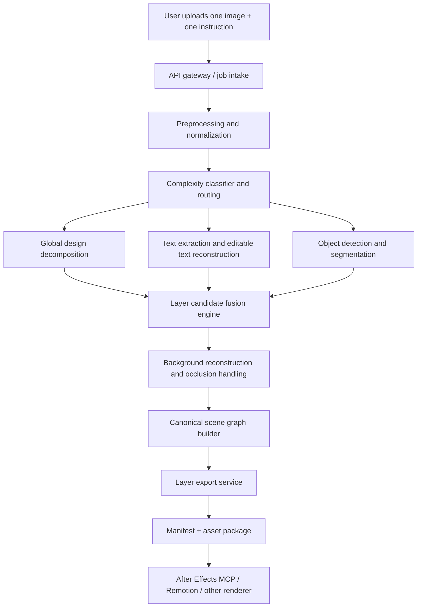
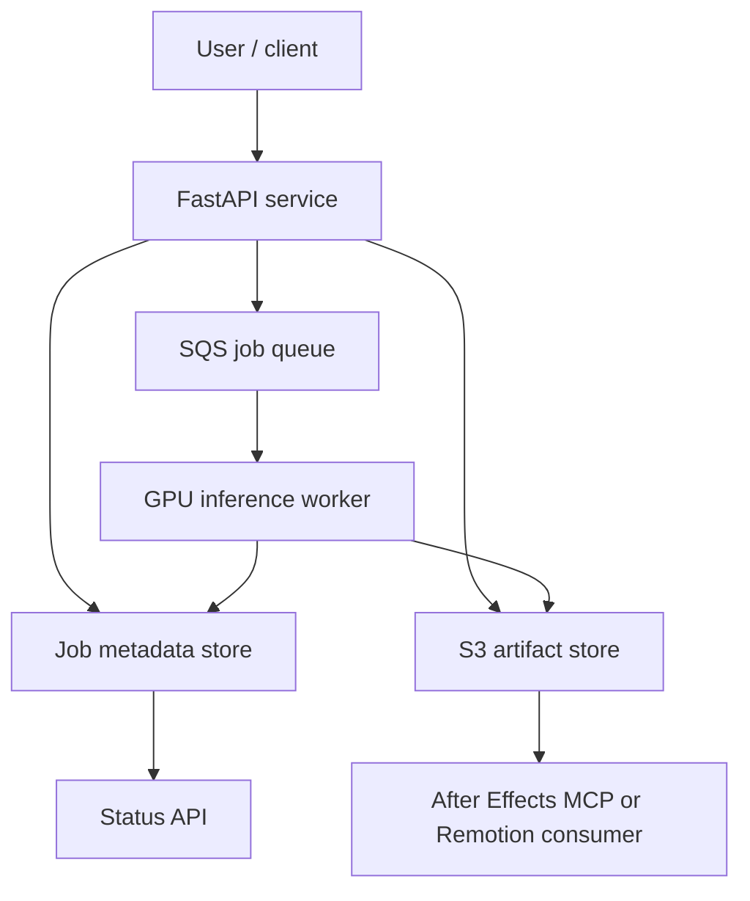

# Single-Image Layer Extraction and Motion-Ready Asset Generation Architecture

Status: Draft  
Date: 2026-03-31  
Audience: Product, AI engineering, backend engineering, graphics pipeline engineering  
Primary goal: Convert one input image plus one user instruction into a motion-ready layered asset package that can drive After Effects MCP, Remotion, or a similar animation workflow.

## 1. Executive Summary

This project should be built as an open-source-first, hybrid AI pipeline for decomposing a single flattened image into reusable layers. The system will not rely on Canva as the core extraction engine. Instead, it will combine design-image decomposition, OCR, segmentation, background reconstruction, and export packaging into one orchestrated pipeline.

The architecture is intentionally designed around one hard truth:

- A single flattened image does not preserve the original source layers perfectly.

Because of that, this system must be designed for:

- high automation on clean design-like inputs
- best-effort extraction on harder inputs
- strict confidence guardrails so the product never pretends to be exact when it is not

The correct product promise is:

- "We reconstruct motion-ready layers from a single image when confidence is high."
- not "We recover the exact original PSD/Canva/After Effects source every time."

For the target domain of SaaS social creatives, landing page hero sections, ad graphics, dashboard marketing designs, and similar layouts, this architecture is feasible and strong.

## 2. Problem Statement

The user workflow we are solving is:

1. A user provides one reference image and one instruction.
2. The system must detect every meaningful visual element from that image.
3. The system must export each element as:
   - a tight transparent crop
   - a full-size transparent canvas image placed in the original position
4. The system must preserve enough structure so a downstream animation engine can animate each element independently.
5. When possible, text should become editable text objects rather than only raster snippets.
6. The process should run with minimal or no human intervention.

The major pain point is not file export. The major pain point is reliable decomposition of a flat raster image into separable elements, especially when the image contains:

- overlapping components
- effects such as shadows, glows, and gradients
- stylized text
- screenshots embedded inside cards
- icons mixed with shapes
- missing background content hidden behind foreground objects

## 3. Locked Product Assumptions

This architecture is based on the decisions already clarified:

- Input is always `one image + one instruction`.
- The product should prioritize:
  - clean marketing creatives, SaaS ads, hero sections, dashboard creatives
  - but still attempt harder arbitrary single images on a best-effort basis
- Output policy is `best effort + guardrail`.
- Export format must include both:
  - tight crop PNG
  - full-size transparent PNG at original position
- Editable text is a target, but only when confidence is high enough.
- The core extraction engine should be open source, not Canva API dependent.
- Local development happens on a laptop.
- Cloud GPU is allowed for testing using AWS credits.

## 4. Product Goals

### 4.1 Primary Goals

- Detect and separate meaningful visual layers from one flat image.
- Produce layer assets that are immediately useful for animation.
- Recover text content and reconstruct editable text when confidence is high.
- Preserve geometric fidelity:
  - original position
  - original width and height
  - correct stacking order
- Export a machine-readable manifest for downstream animation tooling.
- Be honest about uncertainty and unsupported cases.

### 4.2 Secondary Goals

- Support re-targeting outputs to:
  - After Effects MCP
  - Remotion
  - HTML/CSS motion graphics
- Support future export to PSD-like and PPTX-like editable packages.
- Build a benchmarkable pipeline where each stage can be improved independently.

## 5. Non-Goals

The V1 architecture should not promise:

- exact recovery of original source design files
- exact reconstruction of every hidden pixel behind occluded objects
- perfect editable text for every font and every text effect
- reliable decomposition of arbitrary photographs into semantically useful motion layers
- exact blend mode, vector path, or original grouping recovery from all images

## 6. What the System Should Output

For each job, the system should produce:

- extracted layer images
- recovered editable text objects when confidence is high
- reconstructed background layers
- scene metadata
- per-layer confidence scores
- warnings when the output is approximate
- downstream-ready package for motion generation

The minimum useful output artifact is a folder with:

- `layers/cropped/*.png`
- `layers/full_canvas/*.png`
- `manifest/scene_manifest.json`
- `preview/reconstructed.png`
- `preview/overlay_debug.png`
- `logs/job_report.json`

## 7. Architectural Principles

### 7.1 Hybrid Over Monolithic

No single current model should be trusted to solve:

- layout detection
- text extraction
- text editability reconstruction
- object segmentation
- background reconstruction
- export packaging

The architecture must combine specialized models and deterministic post-processing.

### 7.2 Confidence-Driven Execution

The system should always know which outputs are:

- high confidence
- medium confidence
- low confidence

Low-confidence outputs should be flagged or downgraded rather than silently emitted as exact.

### 7.3 Deterministic Packaging

Model outputs may be probabilistic, but the export, naming, coordinate normalization, and manifest generation must be deterministic.

### 7.4 Domain First, General Second

The first strong product should target design-like inputs. Hard arbitrary images should be handled by fallback logic, not by overpromising.

### 7.5 Downstream Tool Neutrality

The extraction system should not be tightly coupled to one animation engine. It should emit a canonical layer representation that can feed:

- After Effects MCP
- Remotion
- HTML/CSS/Canvas animation tools

## 8. High-Level Architecture



## 9. Core Subsystems

### 9.1 API and Job Orchestrator

Responsibilities:

- accept uploads and instructions
- create job ids
- persist job state
- trigger inference pipeline
- expose status and artifacts

Recommended stack:

- FastAPI for API service
- Python for orchestration
- Redis or SQS for async queueing
- Postgres or DynamoDB for job metadata

### 9.1.1 Instruction Interpreter

Even though the first input contract is simple, the system still needs a lightweight instruction interpreter.

Responsibilities:

- classify the user's instruction intent
- choose output mode:
  - extract only
  - extract + package
  - extract + handoff to renderer
- select renderer target if specified
- apply optional export preferences such as:
  - transparent backgrounds
  - layer grouping
  - text editability preference

The interpreter should be deterministic where possible. A small rules layer should handle most V1 instructions. An LLM can be added later for more flexible command understanding, but it should not be required for the base extraction path.

### 9.2 Preprocessing and Normalization Service

Responsibilities:

- validate input image
- convert color space
- standardize resolution buckets
- denoise if needed
- create multiple analysis views
- detect alpha channel presence
- compute quick complexity features

Key outputs:

- normalized image
- thumbnail image
- candidate scales
- image quality metrics

### 9.3 Complexity Classifier and Router

Responsibilities:

- estimate whether the input resembles:
  - design-heavy creative
  - web screenshot / hero layout
  - arbitrary artistic or photo-heavy image
- decide whether to use:
  - design-first pipeline
  - general fallback pipeline
  - reduced-confidence mode

This classifier is not the final extractor. It is a routing and expectations component.

### 9.4 Design Decomposition Engine

Responsibilities:

- produce coarse layer proposals from the entire image
- separate large semantic groups such as:
  - background
  - cards
  - screenshots
  - button groups
  - illustrations
  - logos
  - headline blocks

Primary candidates:

- LayerD for raster graphic design decomposition
- Qwen-Image-Layered for multi-RGBA decomposition and layered export experiments

### 9.5 Text Intelligence Engine

Responsibilities:

- detect text regions
- recover text content
- estimate style attributes
- reconstruct editable text when confidence permits
- fall back to raster text layers otherwise

This engine is critical because text readability is a defining requirement for motion graphics workflows.

### 9.6 Visual Element Detection and Segmentation Engine

Responsibilities:

- detect non-text elements
- segment logos, icons, cards, screenshots, buttons, objects, illustrations
- separate composite elements into motion-friendly pieces

Primary approach:

- GroundingDINO for open-vocabulary detection
- SAM 2 or Grounded-SAM-2 for segmentation

### 9.7 Background Reconstruction Engine

Responsibilities:

- reconstruct a background plate after foreground elements are removed
- inpaint missing pixels behind extracted layers
- generate one or more background variants where needed

This is necessary when the user later animates foreground objects independently.

### 9.8 Fusion and Scene Graph Builder

Responsibilities:

- merge outputs from all upstream engines
- remove duplicate detections
- resolve overlaps
- infer z-order
- define parent-child relationships
- generate canonical coordinates and metadata

This subsystem is where the pipeline becomes a product rather than a bag of models.

### 9.9 Export and Packaging Engine

Responsibilities:

- generate tight crop assets
- generate full-canvas positioned assets
- save transparent PNGs
- write machine-readable manifest
- generate preview reconstruction
- optionally export PSD, PPTX, or HTML packages later

### 9.10 Renderer Adapter Layer

Responsibilities:

- translate the canonical scene graph into renderer-specific instructions
- preserve grouping and stacking order
- map layer coordinates into renderer composition coordinates
- pass text objects in editable form when available

Initial adapters:

- After Effects MCP adapter
- Remotion adapter
- future HTML/CSS adapter

## 10. Recommended Model Strategy

The best architecture is a layered model strategy rather than one master model.

| Stage | Primary choice | Secondary choice | Why it belongs |
| --- | --- | --- | --- |
| Design decomposition | LayerD | Qwen-Image-Layered | Best fit for design-style images and layered reconstruction |
| OCR and text structure | PaddleOCR / PP-StructureV3 | Florence-2 | Strong OCR and layout understanding |
| Text style reconstruction | derendering-text | custom font/style heuristics | Best path toward editable text from raster text |
| Font family approximation | font-classify + Google Fonts corpus | CLIP-style nearest-font retrieval | Needed for editable text guesses |
| Open-vocabulary detection | GroundingDINO | Florence-2 region prompts | Detects logos, buttons, cards, screenshots, icons |
| Segmentation | SAM 2 / Grounded-SAM-2 | Semantic-SAM / SEEM | Strong general segmentation backbone |
| Text mask refinement | Hi-SAM | morphology + OCR masks | Useful for crisp text raster extraction |
| Background removal | BiRefNet | BRIA RMBG-2.0 / rembg | Reliable alpha extraction for many objects |
| Inpainting / background fill | LaMa-style inpainting or SDXL inpainting | custom diffusion inpainting | Needed to reconstruct hidden background |

## 11. Why the Architecture Should Not Depend on Canva

Canva is useful for product inspiration and benchmarking, but not as the core engine for this project.

### 11.1 Canva Is a Reference Tool, Not the Extraction Core

Canva features such as:

- Grab Text
- Magic Grab
- Magic Layers

show that editable decomposition is a real UX category. That validates the product direction.

### 11.2 Why Canva Should Stay Optional

- Public Canva developer APIs focus on design creation and export, not guaranteed bulk extraction of every detected image layer into a local automation pipeline.
- Canva is a product dependency outside your control.
- Open-source architecture gives you:
  - control
  - testability
  - model swap flexibility
  - domain tuning capability

### 11.3 Correct Role of Canva in This Project

Use Canva only for:

- UX inspiration
- manual quality comparison
- benchmark samples
- optional human-assisted fallback in a future version

Do not use Canva as the required extraction backend.

## 12. Detailed End-to-End Pipeline

### 12.1 Step 1: Job Intake

Input payload:

- image file
- instruction string
- optional target renderer
- optional priority level

Validation rules:

- supported file types: PNG, JPG, JPEG, WEBP
- file size limit
- minimum resolution threshold
- aspect ratio sanity check
- corruption detection

Job metadata captured at intake:

- uploader id if available
- source filename
- upload timestamp
- requested renderer
- inferred execution mode
- requested output package type

### 12.2 Step 2: Preprocessing

Operations:

- read image with PIL/OpenCV
- normalize orientation using EXIF
- create RGB and RGBA versions
- create resolution buckets such as 640, 1024, original
- compute edges, saliency maps, and contrast stats
- estimate whether text is likely present

### 12.3 Step 3: Routing and Complexity Scoring

The router assigns a complexity score based on:

- text density
- number of likely objects
- overlap density
- clutter level
- resolution quality
- stylization intensity
- photo dominance versus graphic dominance

Possible routes:

- `design_route`
- `mixed_route`
- `general_route`

### 12.4 Step 4: Global Decomposition

Run LayerD or Qwen-Image-Layered to obtain coarse layer hypotheses.

Expected outputs:

- background candidate
- foreground group candidates
- RGBA layer images
- approximate hierarchy signals

This stage gives global structure but should not be trusted blindly for fine export.

### 12.5 Step 5: Text Path

Run OCR and text region recovery.

Sub-steps:

1. detect text boxes
2. classify text lines and blocks
3. recover text content
4. refine text mask
5. estimate font family, size, weight, color, alignment, letter spacing, line height
6. decide:
   - editable text object
   - raster text fallback

Output per text layer:

- text content
- bbox
- polygon or mask
- inferred style object
- confidence score
- raster PNG
- optional editable object JSON

### 12.6 Step 6: Non-Text Detection Path

Use open-vocabulary prompts to detect likely design elements such as:

- logo
- icon
- button
- card
- chart
- dashboard screenshot
- phone mockup
- browser frame
- illustration
- avatar
- badge
- decorative shape

Then segment each detected region with SAM-based models.

Outputs:

- class label
- bbox
- alpha mask
- crop image
- confidence score

### 12.7 Step 7: Background and Occlusion Reconstruction

After text and non-text elements are removed:

- fill exposed holes
- reconstruct clean background
- output background plate

This is essential for:

- parallax animation
- independent movement of foreground layers
- clean composition rebuilds

### 12.8 Step 8: Fusion and Deduplication

Fusion logic should:

- merge overlapping candidates from decomposition and detection paths
- remove duplicates
- split grouped candidates when high-confidence sub-elements exist
- merge fragmented masks when they belong to a single design element

Examples:

- a navbar block may split into:
  - navbar background
  - logo
  - home text
  - pricing text
  - about text
  - contact text
- a card may split into:
  - card background
  - screenshot image
  - title text
  - button background
  - button label

### 12.9 Step 9: Scene Graph Construction

The system should convert fused detections into a canonical scene graph.

Each node should include:

- unique id
- node type
- bbox
- polygon or mask reference
- z-index
- parent id
- child ids
- asset paths
- text metadata if applicable
- confidence
- warnings

### 12.10 Step 10: Export

For each node, export:

- cropped transparent PNG
- full-canvas transparent PNG
- metadata row in manifest

Optional later export targets:

- PSD-like package
- PPTX
- HTML bundle
- After Effects JSON interchange

Naming rules:

- stable slug-based file names
- collision-safe suffixes
- no spaces in generated asset names
- consistent prefixes for groups, text nodes, shape nodes, and image nodes

### 12.11 Step 11: Reconstruction and Verification

The system should recompose the exported layers into a reconstructed preview and compare it with the input image.

Verification metrics:

- SSIM
- LPIPS
- text-region IoU
- layer coverage ratio
- OCR parity on reconstructed text

If reconstruction quality is poor, the job should be downgraded to lower confidence.

## 13. Editable Text Strategy

Editable text is one of the hardest parts of this project. It should be implemented as confidence-based reconstruction, not as a guaranteed output.

### 13.1 Why Editable Text Is Hard

A flat image does not directly contain:

- font family name
- original font file
- kerning table
- exact line height
- original effect stack
- original vector outline

The system can only infer these from rendered pixels.

### 13.2 Recommended Editable Text Pipeline

1. OCR text content
2. detect text region
3. refine text mask
4. estimate font family from a curated candidate set
5. estimate style:
   - weight
   - size
   - fill color
   - stroke color
   - stroke width
   - shadow offset
   - shadow blur
   - opacity
   - alignment
6. render candidate text using a graphics engine
7. optimize parameters to minimize difference to the source text image
8. if similarity passes threshold, emit editable text object
9. otherwise emit raster text layer

### 13.3 V1 Truthful Rule

Text should be marked editable only when:

- OCR confidence is high
- style fit is high
- rendered-versus-source similarity is high

Otherwise:

- keep the text as raster PNG
- record the recognized text content as metadata only

## 14. Canonical Data Model

### 14.1 Job Request Schema

```json
{
  "job_id": "job_20260331_001",
  "instruction": "Extract layers and prepare motion-ready assets",
  "target_renderer": "after_effects",
  "input": {
    "filename": "reference.png",
    "width": 1440,
    "height": 900,
    "mime_type": "image/png"
  }
}
```

### 14.2 Scene Manifest Schema

```json
{
  "job_id": "job_20260331_001",
  "canvas": {
    "width": 1440,
    "height": 900
  },
  "route": "design_route",
  "global_confidence": 0.86,
  "warnings": [],
  "layers": [
    {
      "id": "layer_navbar_bg",
      "name": "navbar background",
      "type": "shape",
      "bbox": { "x": 0, "y": 0, "width": 1440, "height": 88 },
      "z_index": 2,
      "parent_id": null,
      "cropped_asset": "layers/cropped/layer_navbar_bg.png",
      "full_canvas_asset": "layers/full_canvas/layer_navbar_bg.png",
      "mask_asset": "layers/masks/layer_navbar_bg.png",
      "editable_text": null,
      "confidence": 0.95,
      "warnings": []
    },
    {
      "id": "layer_pricing_text",
      "name": "pricing text",
      "type": "text",
      "bbox": { "x": 842, "y": 31, "width": 62, "height": 22 },
      "z_index": 6,
      "parent_id": "group_navbar",
      "cropped_asset": "layers/cropped/layer_pricing_text.png",
      "full_canvas_asset": "layers/full_canvas/layer_pricing_text.png",
      "mask_asset": "layers/masks/layer_pricing_text.png",
      "editable_text": {
        "text": "Pricing",
        "font_family_guess": "Inter",
        "font_weight": 600,
        "font_size_px": 18,
        "fill": "#101828",
        "alignment": "left",
        "confidence": 0.71
      },
      "confidence": 0.79,
      "warnings": ["font approximation"]
    }
  ]
}
```

## 15. Output Folder Layout

```text
output/
  job_20260331_001/
    input/
      original.png
      normalized.png
    layers/
      cropped/
        layer_navbar_bg.png
        layer_logo.png
        layer_home_text.png
      full_canvas/
        layer_navbar_bg.png
        layer_logo.png
        layer_home_text.png
      masks/
        layer_navbar_bg.png
        layer_logo.png
        layer_home_text.png
    manifest/
      scene_manifest.json
      scene_graph.json
    preview/
      reconstructed.png
      overlay_debug.png
    logs/
      job_report.json
      model_timings.json
```

## 16. API Surface

Recommended V1 API:

- `POST /v1/jobs`
  - create a job from one image plus instruction
- `GET /v1/jobs/{job_id}`
  - retrieve status, confidence, warnings
- `GET /v1/jobs/{job_id}/manifest`
  - fetch scene manifest
- `GET /v1/jobs/{job_id}/assets`
  - download generated package
- `POST /v1/jobs/{job_id}/render/after-effects`
  - hand off manifest to After Effects MCP workflow
- `POST /v1/jobs/{job_id}/render/remotion`
  - hand off manifest to Remotion workflow

### 16.1 Suggested Internal Service Interfaces

The internal Python interfaces should stay modular. A recommended split is:

- `Preprocessor.normalize(image) -> NormalizedImageBundle`
- `Router.route(bundle) -> RouteDecision`
- `TextEngine.extract(bundle) -> list[TextCandidate]`
- `ElementEngine.extract(bundle) -> list[VisualCandidate]`
- `Decomposer.decompose(bundle) -> list[GlobalLayerCandidate]`
- `FusionEngine.merge(...) -> SceneGraph`
- `Exporter.package(scene_graph) -> ExportBundle`
- `RendererAdapter.render(export_bundle, target) -> RenderJob`

This keeps the architecture testable and lets you swap model implementations without redesigning the whole system.

## 17. Confidence and Guardrail System

This project should not have a binary success model. It needs graded confidence.

### 17.1 Layer-Level Confidence

Each layer confidence should combine:

- detection confidence
- segmentation confidence
- OCR confidence if text
- reconstruction similarity
- overlap ambiguity penalty
- occlusion penalty

### 17.2 Job-Level Confidence

Job confidence should combine:

- coverage of the image by exported layers
- reconstruction quality
- number of low-confidence layers
- unresolved overlaps
- text recovery quality

### 17.3 Guardrail Actions

If confidence is low:

- emit warning flags
- mark layer as approximate
- switch text from editable to raster
- suppress unsupported claims
- optionally route to review queue in future versions

### 17.4 Recommended Status Values

- `completed_high_confidence`
- `completed_with_warnings`
- `completed_low_confidence`
- `failed_unsupported`
- `failed_processing_error`

## 18. Job Lifecycle and State Machine

Each job should move through explicit states. This avoids vague operational behavior and helps the UI explain progress.

Recommended states:

- `queued`
- `preprocessing`
- `routing`
- `decomposing`
- `extracting_text`
- `extracting_visuals`
- `reconstructing_background`
- `building_scene_graph`
- `exporting_assets`
- `verifying_output`
- `completed_high_confidence`
- `completed_with_warnings`
- `completed_low_confidence`
- `failed_unsupported`
- `failed_processing_error`

Recommended behavior:

- persist state transitions
- record per-state timings
- make states queryable from the status endpoint
- expose warnings as early as they are known

## 19. Performance Targets

V1 should optimize for correctness over speed, but still aim for usable turnaround.

Recommended initial targets:

- small image under 1280px: 15 to 45 seconds on GPU
- medium design image around 1920px: 30 to 90 seconds on GPU
- CPU-only fallback: much slower, mostly for debugging and local verification

These are planning targets, not contractual SLAs.

## 20. Infrastructure Architecture

### 20.1 Local Development Mode

Use this for:

- pipeline development
- prompt and threshold tuning
- OCR tests
- export packaging tests

Recommended local stack:

- Python virtual environment or uv
- FastAPI
- local filesystem artifact store
- SQLite or lightweight Postgres for metadata
- optional Docker only after the pipeline stabilizes

### 20.2 AWS Prototype / Testing Mode

Use this when:

- testing heavier decomposition models
- benchmarking latency
- running batch evaluations

Recommended AWS shape:

- API: FastAPI service
- queue: SQS
- orchestrator: Step Functions or worker-driven queue consumption
- GPU worker: EC2 GPU instance or ECS task on GPU-backed instances
- object storage: S3
- metadata DB: DynamoDB or Postgres
- logs and metrics: CloudWatch

Recommended AWS prototype path:

- API on one lightweight instance or container
- one GPU worker first
- S3 for artifacts
- SQS for asynchronous jobs
- CloudWatch for basic visibility

This is enough to validate the idea before spending time on full production infrastructure.

### 20.3 Lambda Recommendation

Lambda should be used only for:

- lightweight request validation
- job dispatch
- artifact notifications
- small metadata operations

Lambda should not be the main heavy inference runtime for this architecture because the core pipeline benefits from:

- longer-running tasks
- large model loads
- GPU acceleration
- filesystem-heavy asset export

### 20.4 Recommended Deployment Diagram



### 20.5 Worker Execution Model

The GPU worker should execute in a staged but cache-aware fashion.

Recommended worker behavior:

- load heavy models once and reuse them across jobs
- route easy jobs through a cheaper subset of models
- skip text reconstruction if no text is detected
- skip inpainting if a clean background already exists
- emit intermediate artifacts after each stage
- support resumable jobs where possible

The worker should not run the entire pipeline blindly for every image.

### 20.6 Cost-Control Rules

Cost control should be part of the architecture from day one.

Recommended rules:

- route simple jobs through lighter models
- cap max input resolution for V1
- cache normalized images and masks
- cache font candidate embeddings
- avoid running multiple decomposition models unless the first result is weak
- expose per-stage timing and cost estimates

## 21. Technology Stack Recommendation

### 21.1 Primary Language

Use `Python` as the core system language because:

- most required AI and CV libraries are Python-first
- inference orchestration is easier
- export packaging and FastAPI fit well

### 21.2 Optional Secondary Language

Use `TypeScript` only for:

- frontend dashboard
- workflow UI
- optional orchestration shell around the Python services

### 21.3 Core Libraries

- FastAPI
- Pydantic
- OpenCV
- Pillow
- PyTorch
- diffusers
- PaddleOCR
- psd-tools if PSD-like export is added later
- python-pptx if PPTX export is added later

## 22. Suggested Repository Layout

Even before coding begins, the architecture should assume a clean repository structure.

```text
layer-ai/
  apps/
    api/
    worker/
  services/
    preprocessing/
    routing/
    decomposition/
    text_engine/
    visual_engine/
    fusion/
    exporting/
    renderer_adapters/
  models/
    configs/
    prompts/
    checkpoints/
  schemas/
    manifest/
    api/
  tests/
    unit/
    integration/
    regression/
  docs/
    architecture/
    specs/
  scripts/
    benchmark/
    eval/
    local_dev/
```

This structure keeps business logic out of the API layer and makes each pipeline stage independently testable.

## 23. Observability and Debuggability

Every stage should emit:

- start time
- end time
- model version
- confidence outputs
- warnings
- image snapshots for debugging

Recommended debug artifacts:

- OCR overlay
- detection overlay
- segmentation overlay
- final reconstruction overlay
- confidence heatmap

Without these artifacts, the team will struggle to tune the pipeline.

## 24. Renderer Handoff Contract

The extraction system and the renderer must communicate through a stable contract.

Minimum renderer handoff data:

- canvas size
- layer order
- group hierarchy
- per-layer asset paths
- transform origin
- anchor position
- opacity
- blend mode if inferred
- text object metadata when editable
- suggested animation groups

For After Effects MCP, the adapter should map:

- scene groups to compositions or nested groups
- layer coordinates to comp coordinates
- text objects to text layers when confidence is high
- raster assets to imported footage items

For Remotion, the adapter should map:

- each scene node to a React layer component
- layer transforms to CSS transform style
- grouping to nested components
- z-order to render order

## 25. Security and Privacy

Even if the first users are internal, the architecture should assume uploaded images may be sensitive.

Recommendations:

- do not keep raw uploads indefinitely
- use per-job isolated storage paths
- redact logs so they do not expose sensitive text contents unnecessarily
- support TTL-based artifact deletion
- separate public download links from internal debug artifacts

## 26. Quality Evaluation Strategy

The project needs its own benchmark set. Public benchmarks alone are not enough.

### 26.1 Build an Internal Evaluation Dataset

Curate at least these categories:

- SaaS hero sections
- dashboard ads
- social media promo graphics
- feature comparison cards
- posters with bold typography
- mixed screenshot plus decorative layout
- hard arbitrary images for stress testing

### 26.2 Label What Matters

For each benchmark image, label:

- expected meaningful layers
- text content
- approximate z-order
- expected grouped versus split objects
- whether editable text is realistically possible

### 26.3 Key Metrics

- layer recall
- layer precision
- text OCR accuracy
- editable text acceptance rate
- reconstruction fidelity
- average number of missing important layers
- average number of duplicate layers

## 27. Testing Strategy

### 27.1 Unit Tests

Test:

- coordinate transforms
- mask to bbox conversion
- export path generation
- scene graph validation
- manifest schema correctness

### 27.2 Integration Tests

Test:

- one sample image through the full pipeline
- layer export consistency
- reconstruction from emitted layers
- downstream handoff contracts

### 27.3 Regression Tests

Freeze a benchmark set and compare:

- confidence shifts
- missing layers
- OCR regressions
- reconstruction quality changes

### 27.4 Human Evaluation

For motion graphics use cases, human review still matters.

Score:

- readability of text after extraction
- motion usefulness of separated elements
- whether the exported layers are actually usable by editors

## 28. Model Versioning and Experiment Tracking

This project will evolve quickly, so model tracking is part of the architecture.

For every job, record:

- model names
- checkpoint identifiers
- prompt templates
- threshold values
- route decision
- code version
- manifest schema version

This is essential for debugging regressions and comparing experiments fairly.

## 29. Major Risks and Mitigations

| Risk | Why it matters | Mitigation |
| --- | --- | --- |
| Missed small elements | A single missed icon or label breaks trust | high-resolution text and icon passes, recall-first thresholds |
| Duplicate detections | Creates messy exports and broken downstream layering | fusion and dedup stage with IoU and semantic matching |
| Bad editable text guesses | User thinks text is editable but it visually drifts | confidence gates and raster fallback |
| Wrong z-order | Animation output looks incorrect | infer from masks, overlap logic, decomposition outputs, and heuristics |
| Inpainting artifacts | Background plate looks fake when foreground moves | low-confidence warnings and alternate background generation |
| Heavy model cost | AWS credits disappear quickly | benchmark early, cache artifacts, use route-based model selection |
| General-image overreach | Product promise becomes impossible to satisfy | domain-specific positioning and unsupported-case guardrails |

## 30. Phased Delivery Plan

### Phase 0: Benchmark and Research Harness

Deliver:

- job runner
- dataset harness
- baseline metrics
- manual visual debug outputs

### Phase 1: Motion-Ready Raster Layers

Deliver:

- text detection
- object segmentation
- cropped PNG export
- full-canvas PNG export
- scene manifest
- reconstruction preview

This phase alone already creates real value for animation workflows.

### Phase 2: Editable Text Recovery

Deliver:

- OCR-backed text objects
- style inference
- font approximation
- text confidence gating

### Phase 3: After Effects MCP and Remotion Integration

Deliver:

- import adapter for generated layers
- animation template support
- prompt-to-animation bridge

### Phase 4: Hard-Image Fallback Improvements

Deliver:

- better routing
- stronger uncertainty reporting
- partial-scene decomposition for difficult inputs

## 31. Recommended V1 Scope

The strongest V1 is:

- one uploaded image
- one extraction instruction
- design-like image focus
- motion-ready raster layers first
- editable text only when confidence is high
- JSON manifest plus PNG assets
- downstream handoff to After Effects MCP or Remotion

This V1 is realistic, useful, and technically honest.

## 32. Example of Expected Decomposition

For a hero-section image containing:

- navbar background
- logo
- Home text
- Pricing text
- About text
- Contact text
- headline
- subheadline
- CTA button background
- CTA button label
- product screenshot
- decorative gradient shape

the system should ideally export each of those as separate motion-ready nodes, while also grouping them semantically:

- `group_navbar`
- `group_hero_text`
- `group_cta`
- `group_product_visual`

That grouping is very valuable for downstream animation planning.

## 33. Final Architecture Recommendation

Build this project as a hybrid, open-source-first AI system with:

- LayerD or Qwen-Image-Layered for coarse design decomposition
- PaddleOCR-based text intelligence
- GroundingDINO plus SAM 2 for non-text element extraction
- BiRefNet-style alpha extraction and inpainting-backed background reconstruction
- a deterministic fusion, scene graph, and export pipeline in Python

The architecture should prioritize:

- trustworthiness
- decomposability
- measurable confidence
- motion-readiness

The system should never claim exact source recovery from a flat image. Instead, it should become excellent at reconstructing usable motion layers for design-oriented inputs.

That is the product direction that is both ambitious and honest.

## 34. References

- Canva Grab Text: https://www.canva.com/features/edit-text-in-image/
- Canva Magic Studio: https://www.canva.com/en_in/magic/
- Canva Magic Layers announcement: https://www.canva.com/newsroom/news/magic-layers/
- Canva Connect API docs: https://www.canva.dev/docs/connect/
- LayerD project: https://cyberagentailab.github.io/LayerD/
- MG-Gen project: https://cyberagentailab.github.io/mggen/
- Qwen-Image-Layered: https://github.com/QwenLM/Qwen-Image-Layered
- PaddleOCR: https://github.com/PaddlePaddle/PaddleOCR
- Florence-2: https://huggingface.co/microsoft/Florence-2-large
- GroundingDINO: https://github.com/IDEA-Research/GroundingDINO
- SAM 2: https://github.com/facebookresearch/sam2
- Grounded-SAM-2: https://github.com/IDEA-Research/Grounded-SAM-2
- Hi-SAM: https://github.com/ymy-k/Hi-SAM
- BiRefNet: https://github.com/ZhengPeng7/BiRefNet
- BRIA RMBG-2.0: https://huggingface.co/briaai/RMBG-2.0
- rembg: https://github.com/danielgatis/rembg
- De-rendering Stylized Texts: https://github.com/CyberAgentAILab/derendering-text
- Google Fonts: https://github.com/google/fonts
- font-classify: https://github.com/Storia-AI/font-classify
